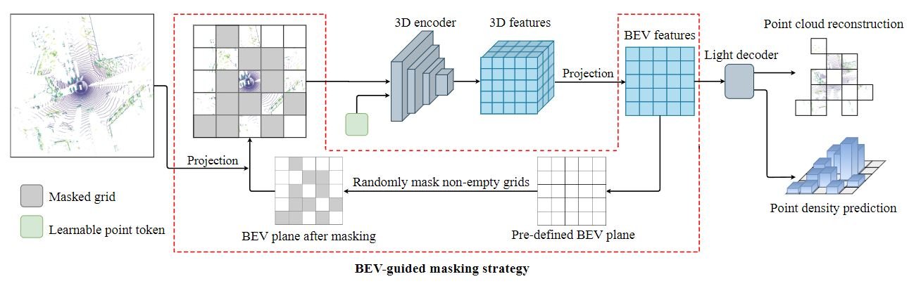

# BEV-MAE: Bird's Eye View Masked Autoencoders for Point Cloud Pre-training in Autonomous Driving Scenarios

This is the official implementation of [BEV-MAE](https://arxiv.org/abs/2212.05758).


## Introduction

Existing LiDAR-based 3D object detection methods for autonomous driving scenarios mainly adopt the training-from-scratch paradigm. Unfortunately, this paradigm heavily relies on large-scale labeled data, whose collection can be expensive and time-consuming. Self-supervised pre-training is an effective and desirable way to alleviate this dependence on extensive annotated data. In this work, we present BEV-MAE, an efficient masked autoencoder pre-training framework for LiDAR-based 3D object detection in autonomous driving. Specifically, we propose a bird's eye view (BEV) guided masking strategy to guide the 3D encoder learning feature representation in a BEV perspective and avoid complex decoder design during pre-training. Furthermore, we introduce a learnable point token to maintain a consistent receptive field size of the 3D encoder with fine-tuning for masked point cloud inputs. Based on the property of outdoor point clouds in autonomous driving scenarios, \textit{i.e.}, the point clouds of distant objects are more sparse, we propose point density prediction to enable the 3D encoder to learn location information, which is essential for object detection.



## Model

We release the pre-training weights of VoxelNet on Waymo dataset.

| pre-trained 3D backbone |      Dataset      |                           Weights                            |
| :---------------------: | :---------------: | :----------------------------------------------------------: |
|        VoxelNet         | Waymo (20% data)  | [Google_drive](https://drive.google.com/file/d/1S2a2uhmRPqWQ6LGcFHfw-Cdch1jdgY6U/view?usp=share_link) |
|        VoxelNet         | Waymo (full data) | [Google_drive](https://drive.google.com/file/d/1d8CXTSjFASXOo9UZ2fhmIyUObClEJ6od/view?usp=share_link) |

Our code is base on [OpenPCDet](https://github.com/open-mmlab/OpenPCDet) (0.5 version). To use our pre-trained weights, please refer to [INSTALL.md](https://github.com/open-mmlab/OpenPCDet/blob/master/docs/INSTALL.md) for installation and follow the instructions in [GETTING_STARTED.md](https://github.com/open-mmlab/OpenPCDet/blob/master/docs/GETTING_STARTED.md) to train the model.


## Training

See the scripts in `tools/run.sh`


## Acknowledgements

BEV-MAE is based on [OpenPCDet](https://github.com/open-mmlab/OpenPCDet). It is also greatly inspired by the open-source code [Occupancy-MAE](https://github.com/chaytonmin/Occupancy-MAE).


## Citation

If BEV-MAE is useful or relevant to your research, please kindly recognize our contributions by citing our paper:

```bibtex
@inproceedings{lin2024bevmae,
  title={BEV-MAE: Bird's Eye View Masked Autoencoders for Point Cloud Pre-training in Autonomous Driving Scenarios},
  author={Lin, Zhiwei and Wang, Yongtao and Qi, Shengxiang and Dong, Nan and Yang, Ming-Hsuan},
  booktitle={Proceedings of the AAAI conference on artificial intelligence},
  year={2024}
}
```


## Contact Us

If you have any problem about this work, please feel free to reach us out at `zwlin@pku.edu.cn`.

The project is only free for academic research purposes, but needs authorization for commerce. For commerce permission, please contact `wyt@pku.edu.cn`.
